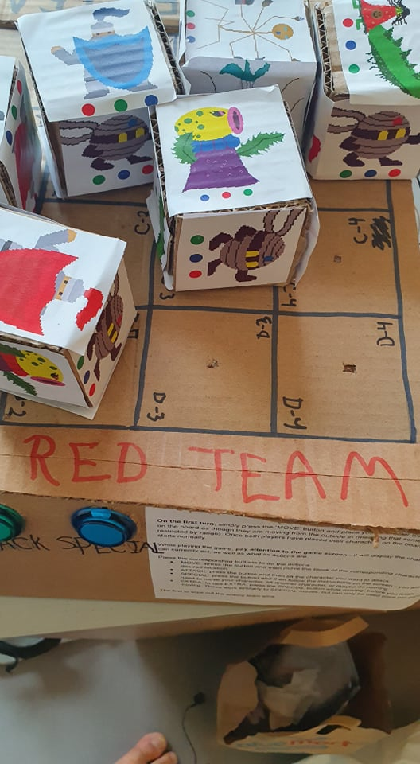

# **CONCEPT**

*Micro Wars* is a turn-based strategy game that preserves the depth and pacing of larger-scale strategic games, while trying to make it more accessible. The game is controlled through a physical board that takes player inputs and a screen that uses supporting images to instruct the players on what to do.

This accessibility is represented through a focus on competition, symmetry between players, and openness to simpler forms of creativity. The mechanics of *Micro Wars* are based on games such as *Fire Emblem*, *Disgaea*, and *Into the Breach*, all of which are games that feature gameplay on a chess-like grid and different characters with specific abilities (which I have implemented as well), but with a focus on single-player gameplay, enhancing elements such as character growth and customization, story elements, or highly challenging situations in which the player must play at a disadvantage compared to the enemy. The appeal of these games is two-fold, between the joy of meeting many different unique characters and then seeing how they can interact in-game, and gameplay that requires measured calculation. *Micro Wars* preserves these elements, by keeping fidelity to these game's mechanics and featuring a diverse cast of colorful characters. However, *Micro Wars* also allows for a competitive environment that is similar to what makes fighting games engaging. A full round of *Micro Wars* is much shorter, compared to even an average game of chess. This would, hopefully, make it easier for players to learn the game through repeated playing and come up with new strategies faster. 

The physical interface is meant to make the game more accessible in the context of an exhibition. Players would not only be drawn to the complexity of the game, but also to the physical and tactile nature of the physical interface.

[[How?]]

# **BEHAVIOR**

Here is a [link](https://docs.google.com/document/d/1gmuQoXyX3fguGp9TEuZXX2jHlozByviMlpZIkkNpt-E/edit?usp=sharing) to the manual for the game. It briefly explains the rules of the game and how to carry out different actions, as well as what are the keyboard shortcuts to play the game in case the board malfunctions. 

The game uses a chess-like grid and a turn-based system. Characters can move around the grid during their turn (done by pressing the MOVE button), limited by their “move”, which is an integer that defines how far they can move. This movement is measured through adjacent blocks, meaning that diagonal movement is only possible if a character moves twice (once horizontally and once vertically). To move, players must use the physical interface. The physical board is a 4x4 grid, with Light Dependent Resistors placed on each cell. The LDRs are meant to detect if there is a block on that cell, by letting the Arduino send a message to processing whenever the value of the LDR changes past a certain threshold. This reads which cell the block was moved to, and carries out the movement accordingly.

The physical board also has six buttons, three for each player to both choose their characters and for them to do their actions during the game. 

During their turn, characters can either move, pass their turn, or move and then either use their Attack, Special, or Extra. Attacking (done by pressing the ATTACK button) is simply dealing damage to enemies that are within their “range” (all characters have a range of 1, except for the Stick Robot, who has a range of 2). Special moves and Extra moves have a variety of effects, from dealing damage with an additional effect, to strengthening allies with either more defense or attack. An Extra move is done by pressing the SPECIAL button after having pressed the MOVE button but before moving the character on the board. This is deliberately a complicated process, because an Extra move can only be used once per game and is meant to push players to be thoughtful about when to use the move. This also adds another layer of complexity to the game, as it means that Extra moves can only be used after having also moved. 

Whenever players choose an action, a message in red appears on the screen telling them what to do, such as to move the character on the board, or to lift the character they want to attack. 

Each character has a certain amount of Hit Points (HP) and these are reduced whenever they are attacked by other characters (characters can also damage themselves). How much damage a character’s attacks deal depends on their attack stat, which also varies depending on the character. 

In the physical interface, characters are represented by blocks that can be moved around. Each block has an image for each character along with three circles (each either red, green, or blue), which represent the order in which the buttons must be pressed in character select to choose that character. 

Below is a description of every character. I’ve put a screenshot of how their attacks and stats are described in the game, as well as an explanation of what each character is trying to achieve in the greater context of the game. Note - all characters are referred in-game through a hispanic name… this is mostly just for fun and to give the characters more personality than by giving them generic names like “Defender” or “Flower Lady”. In the code and in the manual though, they are referred to by their more descriptive, less humanizeable names.

## DEFENDER (Ricardo)

Out of all the characters, it is the only one that is recognizably human, which I think is important in allowing players to have some degree of familiarity with the characters. His strategic function is quite clearly communicated - it is a knight and carries a big shield, evoking the idea that having this character in your team will give your other more frail characters some protection. Mechanically, this is conveyed through the character’s high hp and low attack, as well as his “Protection” move, which allows him to boost the defense of an ally, decreasing the damage they would otherwise take from incoming attacks. Defender’s Extra move, shield throw, gives the player the ability to have an extra burst of damage when they need it, with the risk of sacrificing the Defender’s defensive utility.

## SWAMP MONSTER (María)

The Swamp Monster is meant to give the image of a child, while carrying a large menacing tail behind it. The design is meant to be both cute and a little unsettling, using the iconography of a dress and a smiling face, juxtaposed with green skin, a giant tail with spikes, and a lot of moss growing around the character’s body. The character is actually also shorter than the others, further giving the image of it as a child. 

Mechanically, the Swamp Monster is a frail, close-range attacker. It has high attack and move and all of its special moves are for dealing extra damage. However, it only has 2 hp, meaning that it will need to be protected or very careful in the way it plays, or it may leave itself vulnerable to be taken out very early on. It’s Tail Slam attack pushes enemies back by a tile, or simply causes them and the opponent behind to take one additional damage (the text is unfortunately incomplete in the game, due to a bug in the code that I didn’t have the time to fix…). The Tail Twist attack has the potential to do a lot of damage to the opponent, but must be used sparingly as it causes the Swamp Monster to take damage as well.

## STICK ROBOT (L1UV14)

The Stick Robot’s appearance makes it look a little like a frantic bug, evoking the sense of a character with erratic movements. It is packed with a bunch of different weapons, allowing it to deal damage to anything that draws near. Truly a killing machine… even though it is skinny and frail.

The Stick Robot is what in game design would be referred to as a “glass cannon” - a character who either “blows up or gets blown up really quickly”. It only has 1 hp, but has 2 attack and the ability to move very quickly around the board. It is also the only character to have additional range on its attacks (its range is 2), meaning that it could support other characters by attacking from a distance. Its abilities are Teleport, which is meant to be used more as an escape tool than anything else, and Hug, which is the most damaging move in the game, but only has one range. 

## META KNIGHT? (Norm)

This character is referred to in the manual as “Meta Knight?” because most people who would look at it would comment on its resemblance to [the famous Kirby character.](https://vignette.wikia.nocookie.net/kirby/images/1/12/MetaKnightSmash.png/revision/latest?cb=20180612180148&path-prefix=en) I designed him with the idea of creating a character that had good all-round stats and that could fulfill a variety of roles - hence why he is made of very simple shapes). But I also wanted to give him a little bit of personality, which is why I included the bandages and the active position, looking like he is ready to strike. 

Mechanically, the character lives up to it’s all-round character objective. Its stats are all good, none of them standing out more than others. Because he is so “normal”, he does not have a special move - I believe this would otherwise make him too powerful, as his stats are all good. But he has the ability to sacrifice himself to make another character receive all of his remaining hp, meaning that he can turn another character into an sturdy powerhouse. 

## FLOWER LADY (Petuña)

I was interested in making a character that was plant-themed. At the same time, I realized that of my characters only the Swamp Monster would probably not be referred to as male if seen by an outsider. So I wanted to create a character that had move female traits and that also incorporated the plant aesthetic, which is how I arrived to creating this character. 

Mechanically, the flower lady takes on the role of a supporter. She is unable to attack normally, but has very high hp and her special moves allow her to either strengthen the attacks of her allies or weaken those of her opponents. She can also strengthen herself in order to be able to attack (though I think there is a bug in the program that prevents this from happening). 

## GIANT ONION (El Cebollón)

I was originally going to have only 5 characters, but then I realized that having 6 characters would help make the coding much easier. So, the Onion came in later in the process, since the characters would be chosen by pressing 3 buttons in any order, and 3! = 6. I wanted this last character to be a sort of “wild card”, so I thought of making a character that could not move, but that most of its damage would be dealt through receiving damage instead of dealing it. I first thought of making some kind of spiky monster without legs, but the Onion ended up being what I went for. 

As mentioned, the Onion cannot move, except by using its “Dig” move (which ends its turn). It also does not have an extra move, having instead a “passive ability” that is always active, allowing it to damage any enemies that attack it and that are within 1 range when doing so. I am not very sure how the onion works together with other characters, but it certainly provides an interesting challenge for players to deal with. How can they take the Onion down without falling in the process?

All of these characters can then be combined in any way to make the team that the player will use to play. Each of them bring something different to the table, which is hopefully what allows players to express their creativity in the game and gives them a reason to keep coming back and seeing what else the game has to offer. 

# **WHAT CAN BE IMPROVED**

During the showcase, some things went wrong with the game. At one point, during one of the games the game window went white and did not display any character. It was also not taking any input. I have no idea why this bug happened, but it goes to show that the code can be revised. 

I also did not have time to make the instruction booklet appealing. Nobody was willing to read it, meaning that it turned into a meaningless piece of paper while I explained the rules myself. It could also be simply because of the festival format of the showcase, where nobody would want to spend too much time on any particular thing, because they want to see what the entire showcase has to offer. Perhaps this simply means that the game is not meant for an environment like the IM showcase, but it is certainly something to be considered. The same can be said about the short instructions that were besides the buttons on either side of the board. 

Speaking about the showcase again, I could have really benefited from having a lamp on the table to keep the light on the board consistent, or at least to be able to tweak the threshold of the LDR’s under the light of the showcase. Because of this, a lot of the LDRs were not reading whether there was a block on them, meaning that I had to input these values onto my laptop. However, once the showcase ended some more people played the game, and most of the LDRs were working just fine, so that is good to know.

Regardless, there was one LDR that seemed to be defective. It was constantly giving a reading of 67 on the Arduino terminal, but I had no time to change it before the showcase. 

The board could have also used a better treatment in terms of aesthetics, perhaps being made of a heavier material like acrylic, so that it did not feel too flimsy. 

The digital interface of the game can also still be worked on. As mentioned before, there are bugs and text that cannot be read. But there is also the fact that the red text that tells you what to do sometimes blends with the red features of the red team characters. 

The presentation on the physical component could also be tightened. I don’t think the board felt appealing to use, and for many it was probably unapproachable and probably not very nice to use. In fact, a friend of mine who played the game several times simply learned the shortcuts on the keyboard and was using that instead of the board. 

# **FEEDBACK FROM USER TESTING**

Because making my board proved to be a complicated ordeal with many parts that did not come together until very late, I was not able to properly “user test” my final. However, I was able to play test the mechanics of the game. I did this twice, once using paper and once using an unfinished version of the board. Both times the players said that they wished that they played more than what they did, and said that there seemed to be a lot of complicated things happening in the game.

When I playtested with the cardboard prototype, one player (Hatim, pictured below) also said that the blocks were the right size to feel really well on one’s hand. 

Much more testing should have been done on this project, as it relied heavily on its mechanics working effectively with each other, but this was very hard to do due to the time constraints.

*Image of playtest with board prototype*

# **IMAGES**

*Character blocks*

*Blocks spread on the board*

*Side view of the board, where the buttons are*

*The board with nothing on it. The numbers and letters on the board are the locations that are displayed on the screen for each character*

*Final look at the cables*

*A look at the solderable breadboard*

