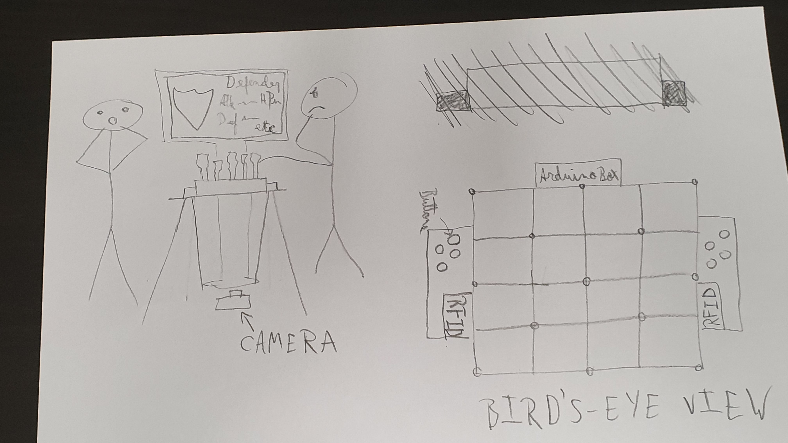

**PROJECT DESCRIPTION**

I will make a strategy board-game that displays the necessary information through a screen but that is controlled through physical pieces on a board. The main idea behind the game is that players are allowed to make their own team out of various possible "characters" that play differently.

**ROUGH sKETCH**

Side view of what the final project would look like and bird's eye view. This might change to having the camera above the board, because I realized that cables inside the board might make it difficult to use computer vision effectively from beneath the board.

The game would be played on a glass table and the board should be of transparent acrylic.

**CIRCUIT SCHEMATIC**

